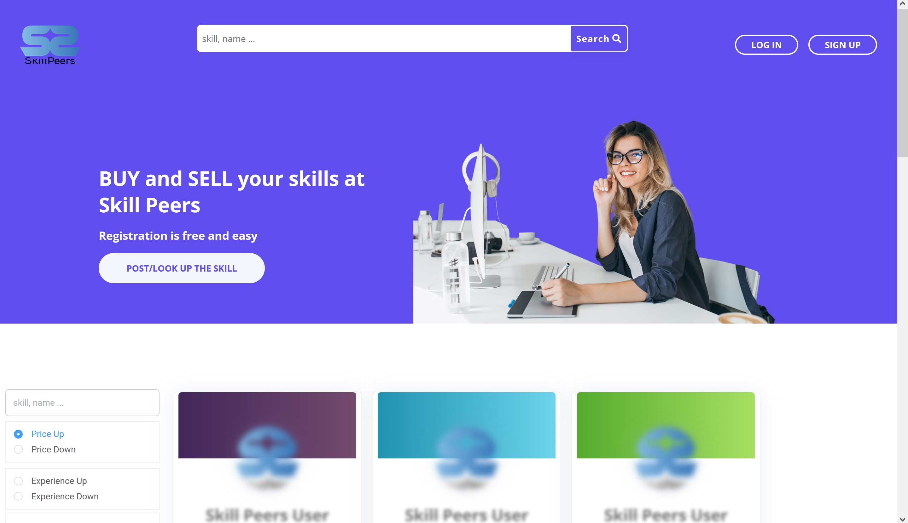
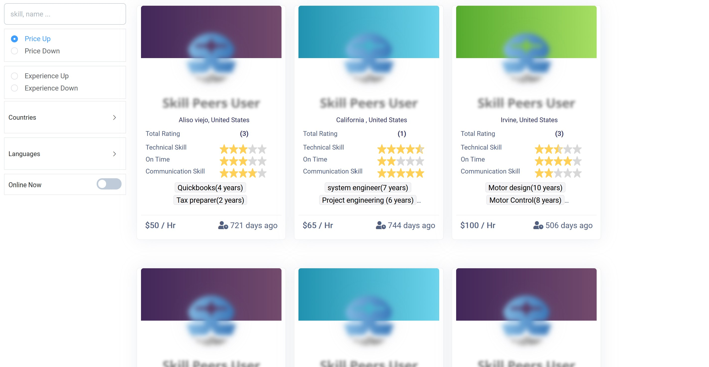
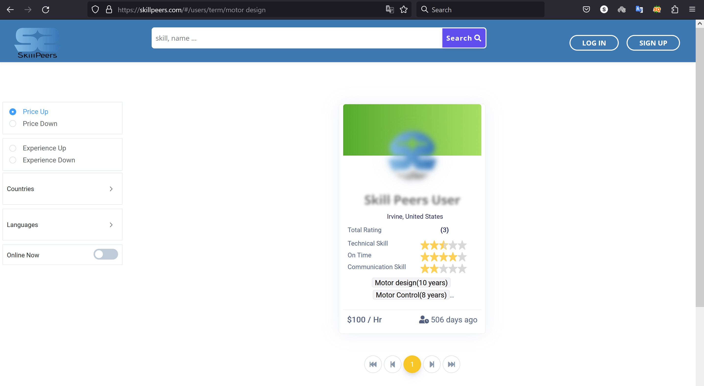
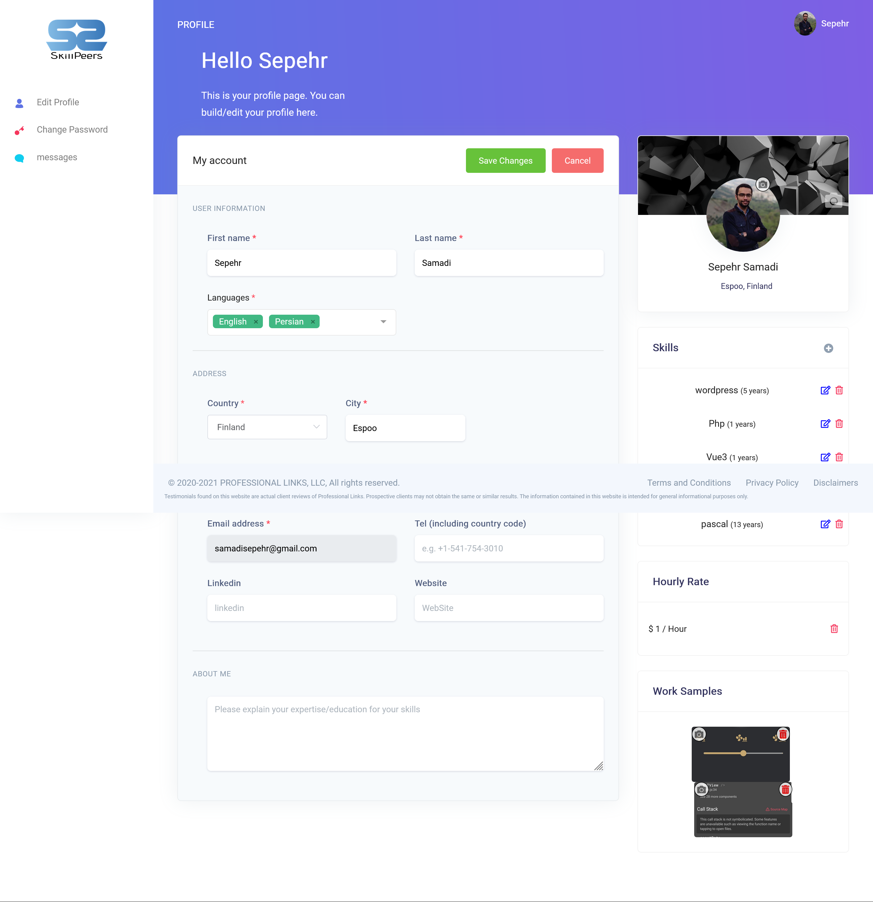
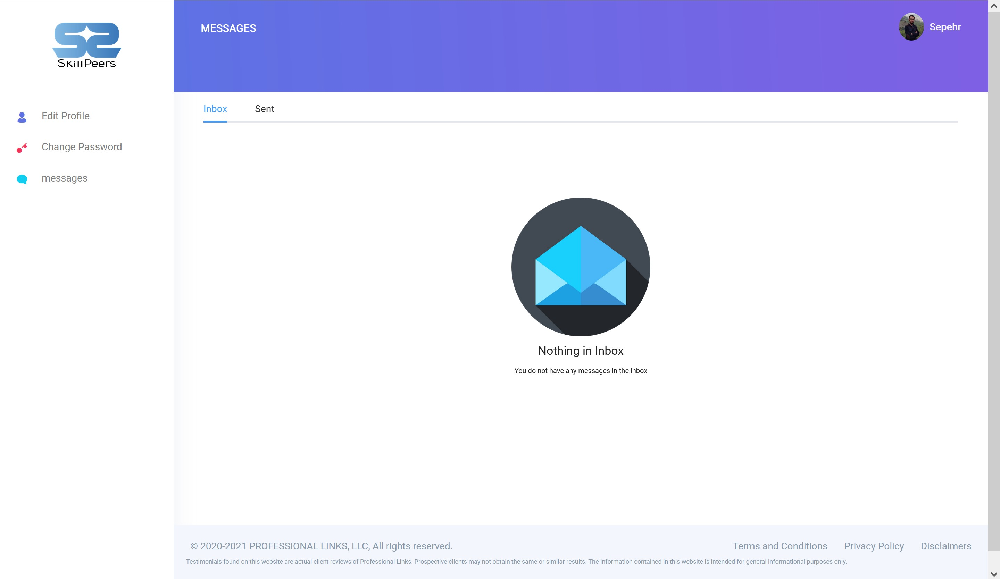

# Welcome to skillpeers.com

This is the repository for skill peers website (only UI codes). This website is created to connect skilled professionals to potential employers. We have used Vue.JS to create the front-end of this website and Java for the back-end side.

Every person can register in this website and create a user account for him/her self. Users can add a profile picture, add their educational and professional background and a list of skills that they have. Also, users should add an hourly bid for the services that they can provide. Besides, they can attach their CV and/or add pictures of their previous.

Employers can see a list of professionals and filter them based on their location, their skills and online professionals. Also, they can sort them based on their experience level and/or their hourly bids. Employers can search the professionals based on their name, specific skills, and etc.

We have implemented a built-in messaging system so that employers can connect to professionals in a safe and easy environment. This messaging system is connected to user's email account so they can be notified about the new messages.

Also, there is a rating system implemented in this system. Every 2 people that have had at least one double-sided conversation inside the built-in messaging system, can rate each other with stars from 0 to 5.

# Table of Contents

1. [How to launch the project](#how-to-launch-the-project)
2. [Overview of the project](#overview-of-the-project)

# How to launch the project
First, in the project directory, run:

### `npm install`

In the project directory, you can run:

### `npm start`

Runs the app in the development mode.\
Open [http://localhost:3000](http://localhost:3000) to view it in your browser.

The page will reload when you make changes.\
You may also see any lint errors in the console.

### `npm test`

Launches the test runner in the interactive watch mode.\
See the section about [running tests](https://facebook.github.io/create-react-app/docs/running-tests) for more information.

### `npm run build`

Builds the app for production to the `build` folder.\
It correctly bundles React in production mode and optimizes the build for the best performance.

The build is minified and the filenames include the hashes.\
Your app is ready to be deployed!

See the section about [deployment](https://facebook.github.io/create-react-app/docs/deployment) for more information.

### `npm run eject`

**Note: this is a one-way operation. Once you `eject`, you can't go back!**

If you aren't satisfied with the build tool and configuration choices, you can `eject` at any time. This command will remove the single build dependency from your project.

Instead, it will copy all the configuration files and the transitive dependencies (webpack, Babel, ESLint, etc) right into your project so you have full control over them. All of the commands except `eject` will still work, but they will point to the copied scripts so you can tweak them. At this point you're on your own.

You don't have to ever use `eject`. The curated feature set is suitable for small and middle deployments, and you shouldn't feel obligated to use this feature. However we understand that this tool wouldn't be useful if you couldn't customize it when you are ready for it.

# Overview of the project

In the following image, you can see the homepage of the website. The user list is blurry because I'm not currently logged-in and it's done to honor the user's privacy. 

Here is a list of users with possible filter and sort options.

In this picture, I have searched for the term "Motor Design" and here is the result:

Here you can see the user account screen. This is where user can setup the account and add educational and professional background and etc. 

In the next picture, you can see the built-in messaging system. In this sections, you can send and receive messages from different users.

Finally, in this picture, you can see the filters and some of the profiles in a mobile screen. A smooth and accurate responsive design.

